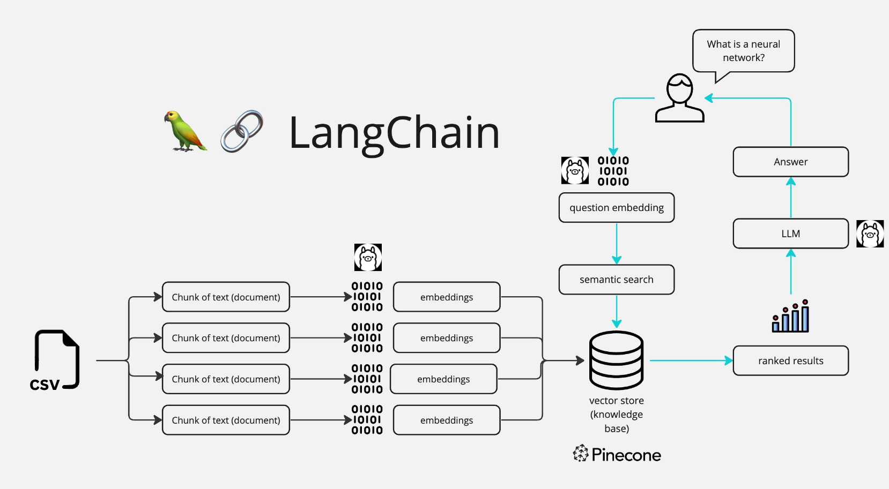

# FileBot
An LLM powered FileBot Streamlit app so you can chat with your CSV files.

## Introduction
The FileBot Chat App is a Python application that allows you to chat with CSV documents. You can ask questions about the CSVs using natural language, and the application will provide relevant responses based on the content of the documents. This app utilizes a language model to generate accurate answers to your queries. Please note that the app will only respond to questions related to the loaded CSVs.

## How It Works

